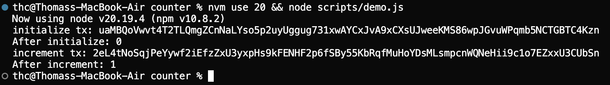

# Solana Counter (Anchor program + Next.js dApp)

Simple on-chain counter built with **Rust (Anchor)** + **Next.js dApp**.  
Demonstrates wallet connection, account creation, and updating persistent state on Solana Devnet.  

**Live demo**: [counter-web-seven.vercel.app](https://counter-web-seven.vercel.app/)  
(Use Phantom on Devnet with test networks enabled.)

---

## What’s Included
- **Anchor program**: stores a `u64` counter on Solana Devnet
- **Next.js client**: connects Phantom, creates counter account, increments state
- **Program ID**: `2esiwqpYjizvnSQBFcvo5cSNbgzpPVfTW2ew24YUiHj1`  
  [View on Explorer](https://explorer.solana.com/address/2esiwqpYjizvnSQBFcvo5cSNbgzpPVfTW2ew24YUiHj1?cluster=devnet)

---

## 🛠Tech Stack
- **Smart contract**: Rust, Anchor 0.31.1
- **Frontend**: Next.js 15, React 19
- **Wallet**: Phantom (Devnet, test networks enabled)
- **Deployment**: Vercel (frontend) + Solana Devnet (program)

---

## Screenshots

  

---

## Structure
- `counter/` → Anchor program + IDL
- `counter-web/` → Next.js dApp
- `scripts/` → Optional Node.js scripts for CLI demo (init, increment, read)

---

## Notes for Reviewers
- No keypairs committed (`.gitignore` enforced).
- Built and deployed successfully on **Devnet**.
- Can extend into more complex stateful dApps (multi-user counters, token integrations, etc.).

---

## License
MIT © 2025 Thomas Clinard
