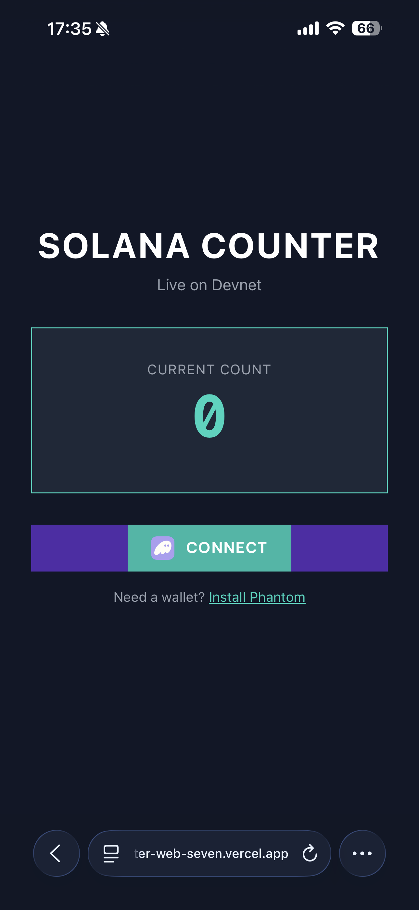

# Solana Counter ⚡

**A minimal, production-grade Solana dApp that demonstrates PDA initialization, on-chain state updates, and a resilient client.**

[](https://solana.com/)
[](https://anchor-lang.com/)
[](https://www.rust-lang.org/)
[](https://www.typescriptlang.org/)
[](https://nextjs.org/)

## 🎮 » LIVE DEMO «
Connect your wallet and try it on Devnet:
`https://counter-web-seven.vercel.app/`

### 🔧 Setup Required
1. Switch your wallet to Devnet
2. Ensure you have a small amount of devnet SOL
3. Connect and use “Create Counter”, then “Increment”

Wallets may show warnings for unknown devnet sites. That’s expected for test dapps.

---

## What is this?
A lean, well-instrumented example of:
- PDA-based account initialization (no extra client-side signer)
- Deterministic account layout (Anchor discriminator + `u64`)
- Robust transaction flow (finalized blockhash, compute budget, structured confirmation)
- Wallet Standard integration (no hard-coded Phantom adapter)
- Resilient RPC usage with endpoint health checks and failover

**Program ID (Devnet)**: `2esiwqpYjizvnSQBFcvo5cSNbgzpPVfTW2ew24YUiHj1`  
[View on Explorer](https://explorer.solana.com/address/2esiwqpYjizvnSQBFcvo5cSNbgzpPVfTW2ew24YUiHj1?cluster=devnet)

---

## Key Features
- **PDA Counter**: Creates a deterministic PDA (`[b"counter"]`) and stores a `u64` value.
- **Reliable Sends**: Fresh finalized blockhash, small priority fee via compute budget Ix, and object-based confirmation `{ signature, blockhash, lastValidBlockHeight }`.
- **Clear Errors**: Wallet-first send; on failure, logs nested causes and runs a simulation to surface program logs.
- **RPC Resilience**: Helius-first by env; endpoint health checks, retries, and graceful airdrop fallback to the public faucet when the provider faucet is rate-limited.

---

## Technical Architecture

### Smart Contract (Rust + Anchor)
- `programs/counter/src/lib.rs`
  - `initialize`: creates PDA and sets `value = 0`
  - `increment`: mutates PDA value by +1

### Frontend (Next.js + TypeScript)
- `counter-web/src/app/components/Counter.tsx` — derive/load PDA, initialize, increment, on-chain reads
- `counter-web/src/app/components/WalletProvider.tsx` — Wallet Standard + endpoint health checks
- `counter-web/src/app/hooks/useRateLimitedConnection.ts` — request queue, retries, airdrop fallback
- `counter-web/src/app/utils/rpcEndpoints.ts` — env-driven endpoints and ordering
- `counter-web/src/app/utils/requestQueue.ts` — concurrency limits + pacing

---

## Screenshots

<div align="center">
  <a href="./screenshots/connect.png">
    
  </a>
  <a href="./screenshots/create.png">
    
  </a>
  <a href="./screenshots/increment.png">
    
  </a>
  <br/>
  <em>Connect → Create PDA counter → Increment value (on-chain)</em>
  
</div>

---

## Quick Start

### Prerequisites
- Solana CLI 1.16+
- Anchor CLI 0.31.x
- Node.js 18+
- Rust (stable)

### Local Web
```bash
cd counter-web
npm install

# Option A: explicit URL (takes precedence)
echo 'NEXT_PUBLIC_SOLANA_RPC_URL=https://devnet.helius-rpc.com/?api-key=YOUR_KEY' >> .env.local
# Option B: just a key (URL is constructed automatically)
echo 'NEXT_PUBLIC_HELIUS_API_KEY=YOUR_KEY' >> .env.local

npm run dev
# open http://localhost:3000
```

### Devnet Deploy (optional)
```bash
anchor build
anchor deploy  # requires deployer wallet with devnet SOL
```

---

## Project Structure
```
counter/
├─ programs/counter/              # Anchor program
├─ counter-web/                   # Next.js app
├─ scripts/                       # Node scripts (optional)
├─ screenshots/                   # UI screenshots
└─ tests/                         # Basic integration tests
```

---

## Key Commands
```bash
# Smart contract
anchor build
anchor deploy

# Frontend
cd counter-web && npm run dev
cd counter-web && npm run build
```

---

## Notes
- Devnet-only demo. Wallet prompts on devnet for unknown sites are expected.
- If you later want to keep RPC keys private, proxy JSON-RPC through a server route and use server-only env vars.

---

## License
MIT © 2025 Thomas Clinard
